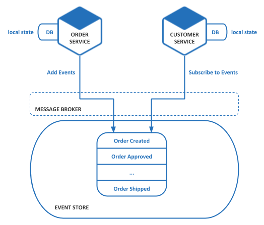
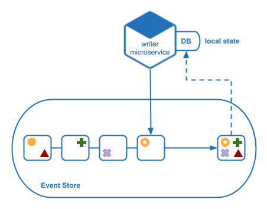
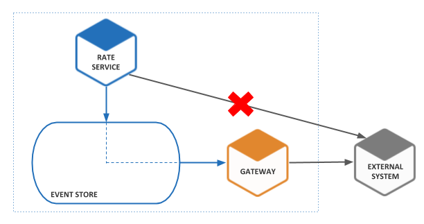
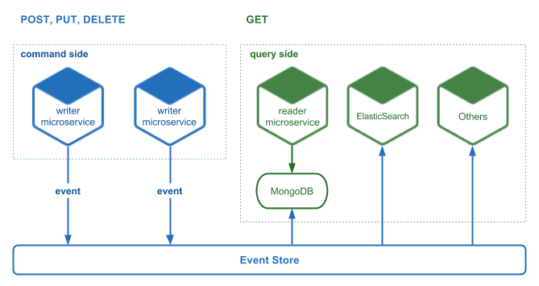
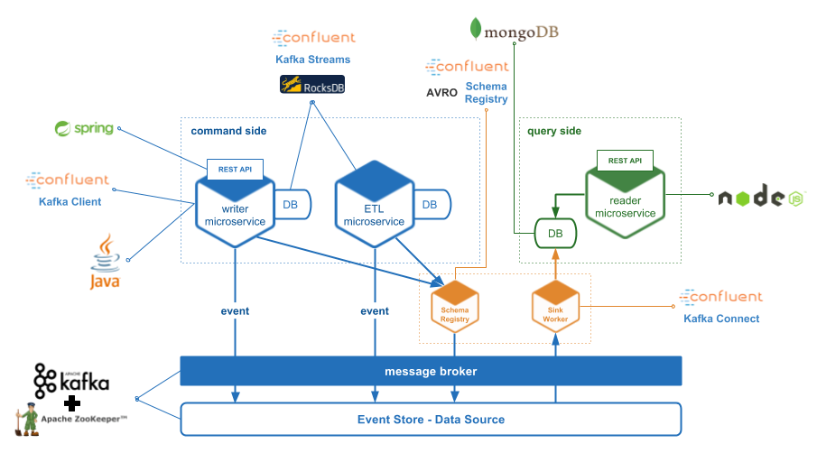

# Event-Driven Architecture Best Practices

In this section we will describe how we work at BEEVA with event-driven architectures.

## Index

1. [Introduction to Event-Driven](#1-introduction-to-event-driven)

2. [Event-driven architectures](#2-event-driven-architectures)

    2.1. [Overview](#21-overview)
    
    2.2. [Patterns](#22-patterns)
    
3. [Tools](#3-tools)

4. [References](#4-references)

## 1. Introduction to Event-Driven
---

Event-driven is a software architecture pattern that promotes the production, detection, consumption of, and reaction to events.

This kind of architectures has follow features:
- Enables high performance, highly scalable systems
- No point-to-point integrations
- No blocking actions
- Reactive system
- It enables having the full history
- It enables an application to maintain data consistency across multiple services

## 2. Event-Driven Architectures
---

### 2.1. Overview

EDA (Event-Driven Architecture) and SOA (Service-Oriented Architecture) are types of architectures that complement each other perfectly and together they are very powerful.
Of course, it is possible to have from monolith, in fact it is a good practice.

The first thing we should do is drive the programming to events, so domain logic will be triggered by events.
An event is something that has happened in the past, so it is absolutely imperative that events always be verbs in the past tense.
The event makes the concept explicit where as previously the changes that would occur within an aggregate or between multiple aggregates were left as an implicit concept that needed to be explored and defined.

This type of design is usually complex and can be very helpful to use DDD (Domain-Driven Design). DDD is an approach to software development for complex needs by connecting the implementation to an evolving model.

### 2.2. Patterns

#### 2.2.1 Event Sourcing

The fundamental idea of Event Sourcing is that of ensuring every change to the state of an application is captured in an event object, and that these event objects are themselves stored in the sequence they were applied for the same lifetime as the application state itself.

Event Sourcing ensures that all changes to application state are stored as a sequence of events. Not just can we query these events, we can also use the event log to reconstruct past states, and as a foundation to automatically adjust the state to cope with retroactive changes.

##### Components:

- **Event Producers** are those able to write events in the event store
- **Event Handlers** are those able to react to an event that comes from message broker
- **Events** are messages stored in the event store and distributed throught message broker
- **Message Broker** is the one responsible for distributing events by the system
- **Event Store** is the place where events are stored

The key to Event Sourcing is that we guarantee that all changes to the domain objects are initiated by the event objects.

##### Benefits

- It solves one of the key problems in implementing an event-driven architecture and makes it possible to reliably publish events whenever state changes
- Because it persists events rather than domain objects, it mostly avoids the object‑relational impedance mismatch problem
- It provides a 100% reliable audit log of the changes made to a business entity
- We can discard the application state completely and rebuild it by re-running the events from the event log on an empty application
- If we find a bug in code, we can correct it and then reprocess the past events to update state with bug fixed
- It makes it possible to implement temporal queries that determine the state of an entity at any point in time
- Event sourcing-based business logic consists of loosely coupled business entities that exchange events. This makes it a lot easier to migrate from a monolithic application to a microservice architecture

##### Drawbacks

- It is a different and unfamiliar style of programming and so there is a learning curve
- The event store is difficult to query since it requires typical queries to reconstruct the state of the business entities
- External interactions are complex to manage

##### Local State

To mitigate the complexity of querying the state of an event log, we can generate a local state in memory or persistent, in the same file system where the service is deployed, in order to quickly know the current state.
Using a stream processor we can listen events that are added to the event log and update its current state in real time.

If the application turn off and then on, the generated state would be lost and would have to be rebuilt it. If we have many events, this can be a very arduous task. To mitigate the impact, we can make snapshots from time to time. If the application needs to reconstruct the current state you will not need to read all the events, just the ones after the snapshot take.

##### External Interactions

One of the problems that we can find when applying this pattern is when interacting with external systems. When we replay an event log, the external system does not know if it is a reprocessing or real time. 

When we have to update an external system we can do it through a gateway, so if we need replay events this gateway avoid making calls out. 

When we need to make external queries, like a money price or rates, and later we replay an event log, we need the past value not the later one. 
To solve this problem we can store responses through a gateway, so when replaying event log gateway can return those responses at the time they occurred.   

#### 2.2.2 CQRS (Command Query Responsibility Segregation)

This pattern is necessary when applying event sourcing. Because saving and processing an event is an asynchronous process, and reading the current state of the entities needs processing in real time. This causes us to be obliged to separate the data input from the output. In a natural way, this pattern appears, which also gives us other benefits such as the denormalization of the views.

These are the most important characteristics:

- Necessary in an event sourced architecture
- Improved separation of concerns
- Supports multiple denormalized views that are scalable and performant

## 3. Tools
---

| Component | Technology |
| --------- | ---------- |
| Message Broker | Kafka + Zookeeper, Rabbit MQ |
| Event Store | Kafka + Zookeeper, MongoDB, MySQL |
| Sink/Source | Kafka Connect |
| Local State DB | In Memory, RocksDB |
| ETL | Kafka Streams, Samza, Spark Streaming |
| Consumer/Producer | Depends of Message Broker (ej. Kafka Client) |

This is an example of architecture

## 4. References
---

* [Pattern: Event Sourcing](http://microservices.io/patterns/data/event-sourcing.html)
* [Pattern: Command Query Responsibility Segregation (CQRS)](http://microservices.io/patterns/data/cqrs.html)
* [Further Enterprise Application Architecture development](https://martinfowler.com/eaaDev/EventSourcing.html)
* [Wikipedia](https://en.wikipedia.org/wiki/Event-driven_architecture) 
* [Eventstore](https://eventstore.org/docs/introduction/4.0.0/event-sourcing-basics)
* [Confluent.io Blog](https://www.confluent.io/blog/event-sourcing-cqrs-stream-processing-apache-kafka-whats-connection)
___

[BEEVA](https://www.beeva.com) | Technology and innovative solutions for companies