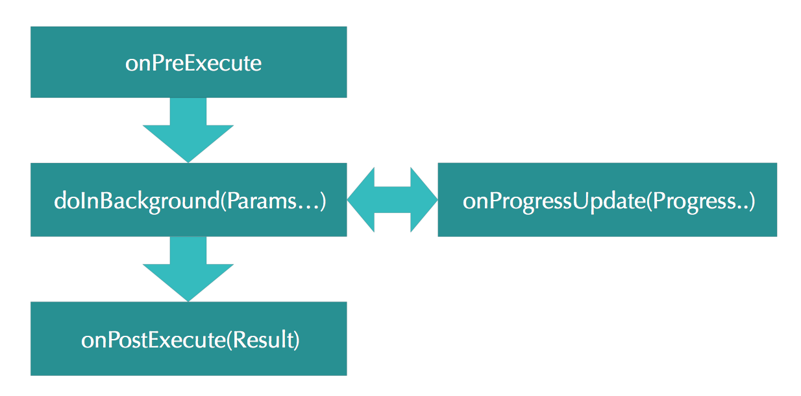

# Best Practices for Background Jobs

An Android application has at least one main thread and in Android, you shouldn’t do anything that blocks the main thread. For work with several thread the Android framework offers different options like [AsyncTask](https://developer.android.com/reference/android/os/AsyncTask.html) and [Services](https://developer.android.com/reference/android/app/Service.html).

##AsyncTask
[AsyncTask](https://developer.android.com/reference/android/os/AsyncTask.html) allows you to perform background operations and publish results on the UI thread without having to manipulate threads and/or handlers. For work with AsyncTask you need to create a new class that extends AsyncTask. When an asynchronous task is executed with AsyncTask, the task goes through 4 steps:

1. **onPreExecute()**: This is called on the UI thread before starting the background job. This step is normally used to setup the task, for instance by showing a progress bar in the user interface.
2. **doInBackground(Params...)**: Invoked on the background thread immediately after `onPreExecute()` finishes executing. This step is used to perform background computation that can take a long time. The parameters of the asynchronous task are passed to this step. The result of the computation must be returned by this step and will be passed back to the last step. This step can also use `publishProgress(Progress...)` to publish one or more units of progress. These values are published on the UI thread, in the `onProgressUpdate(Progress...)` step.
3. **onProgressUpdate(Progress...)**: Invoked on the UI thread after a call to `publishProgress(Progress...)`. This method is used to display any form of progress in the user interface while the background computation is still executing.
4. **onPostExecute(Result)**: Invoked on the UI thread after the background computation finishes. This handles the result coming from the worker thread.



The AsyncTask is used inside an Activity, you need to make sure that it doesn't have a reference to activity or views when activity is already destroyed.

Implementing AsyncTask as an inner class makes sense only if it's static. If it's not static then it will have an implicit reference to outer activity which will lead to memory leaks. If you need references to views from your static async task use [WeakReference](https://developer.android.com/reference/java/lang/ref/WeakReference.html).
Implementing AsyncTask in a separate file is also a good idea, but same rules applied. Use weak references if needed.
The only difference between static inner async task and async task in a separate file is code readability. If there is a lot of logic inside AsyncTask, go ahead with a separate file.

An example of how create and AsyncTask could be found [here](http://stackoverflow.com/questions/9671546/asynctask-android-example).

##Services
The Android framework offers several classes that help you with the operations can cause problems and interfere with the responsiveness of your user interface, the most useful of these is [Service](https://developer.android.com/reference/android/app/Service.html). 

A Service is a component that runs in the background to perform repetitive and long-running operations without needing to interact with the user and it works even if application is destroyed, i.e., internet downloads, checking for new data, data processing, updating content providers. As the service has no user interface, it is not bound to the lifecycle of an activity.

The Service class is abstract, and the only method to be overridden is the `onBind()` one. A service can essentially take two shapes: 

* **Started**: A service is started when an application component starts it by calling `startService()`. Once started, a service can run in the background indefinitely, even if the component that started it is destroyed, and it is active until it has called the `stopService()` method.
* **Bound**: A service is bound when an application component binds to it by calling `bindService()`. A bound service offers a client-server interface that allows components to interact with the service, send requests, get results, and even do so across processes with interprocess communication.


###Implementation and declaration
A service needs an entry in your application manifest. Provide this entry as a *service* element that's a child of the *application* element.

```xml
<application
        android:icon="@drawable/icon"
        android:label="@string/app_name">
        ...
        <service
           android:name=".ExampleService"
           android:label="@string/service_name"/>
        ...
    <application/>
```

The implementing class must extend the `Service` class or one of its subclasses i.e. `IntentService`.

###Started Service
A Started Service is helpful to handle multiple simultaneous request.

When we want to create a Started Service, we have to override the `onBind()` method anyway, if we don't want it to be bound, we can leave it returning null. Instead, what we need to override, is the `onStartCommand()` method.

Android component can trigger the execution of a service via the `startService(intent)` method. If the `startService(intent)` method is called and the service is not yet running, the service object is created and the `onCreate()` method of the service is called.

Once the service is started, the `onStartCommand(intent)` method in the service is called. It passes in the Intent object from the `startService(intent)` call.
If `startService(intent)` is called while the service is running, its `onStartCommand()` is also called. Therefore your service needs to be prepared that `onStartCommand()` can be called several times.

A service is only started once, no matter how often you call the `startService() ` method.

###IntentService
You can also extend the `IntentService` class for your service implementation. It is a particular implementation of a service provided by the patform. The [IntentService](https://developer.android.com/reference/android/app/IntentService.html) is used to perform a certain task in the background. Once done, the instance of IntentService terminates itself automatically.

An IntentService cannot be bound, the way to start it is just with the `startService()` method.

###Bound Service
A Bound  Service is helpful if you need a direct communication between a component and the service.

A Bound Service offers a client-server interface that allows components to interact with the service, the service is the server of this client server architecture, while an activity or another service is the client, therefore, we need an interface to let them communicate properly, for this the platform provides the `bindService()` method.

As mentioned, the Bound Service holds a reference to the clients and, when no more clients are referenced, the service is automatically terminated. This behavior is helpful when we need to share a background operation between multiple activities without the need to close the service because it is terminated automatically.

More info about Bound Services could be found [here](https://developer.android.com/guide/components/bound-services.html).

###Stop a service
A service must be stopped calling `stopSelf()` method, once it is finishes execution. However, you can also stop a service yourself by calling `stopService()` method.
A call to stopService method will call `onDestroy()` callback in your service. You have to manually stop your operation being performed by your application.
No matter how frequently you called the `startService()` method, one call to the `stopService()` stops the service.
