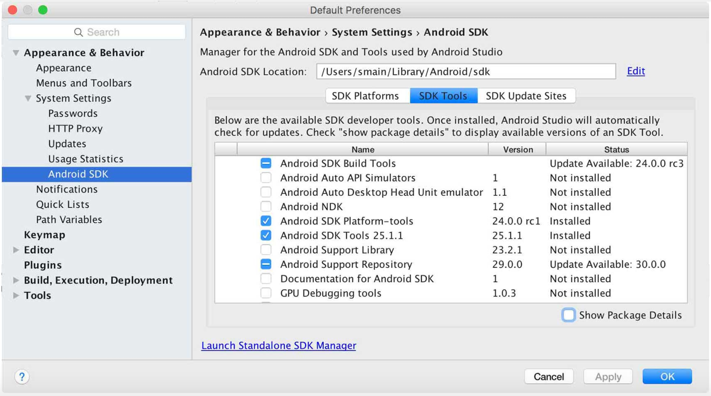
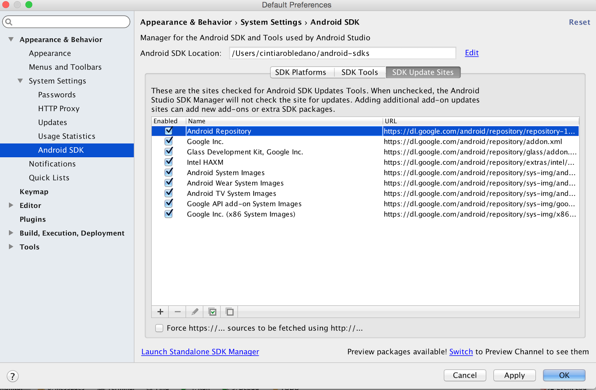
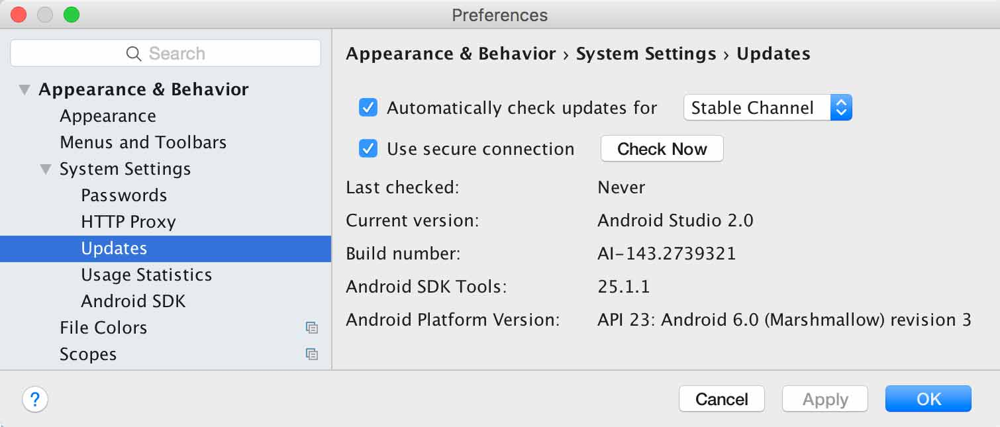

BASIS
=====

Getting Started: official documentation and guides
--------------------------------------------------

The documentation needed to work with Android can be found in the following url:

[https://developer.android.com/index.html](https://developer.android.com/index.html)

In this web page can find three different sections:

   - **Design**: You can find information on Material Design, design patterns, animations, UI design,...

	[https://developer.android.com/design/index.html](https://developer.android.com/design/index.html)

   - **Develop**: You can find information on how to develop on Android. Using Android Studio, information from different APIs, examples,...

	[https://developer.android.com/develop/index.html](https://developer.android.com/develop/index.html)

	There is a section with practical examples that are guided and taught step by step:

	[https://developer.android.com/develop/index.html](https://developer.android.com/develop/index.html)

   - **Distribute**: You can find information to publish your app in the Google Play Store and tips to increase downloads and make your application more visible.

	[https://developer.android.com/distribute/index.html](https://developer.android.com/distribute/index.html)

You can also find free courses taught by Google on the Udacity web page:

[https://www.udacity.com/courses/android](https://www.udacity.com/courses/android)

  
How to install and update Android Studio, JDK, SDK
--------------------------------------------------

### Installation
Android Studio provides the fastest tools for building apps on every type of Android device.

To install Android Studio it is necessary to download java JDK and Android Studio. Both things are available in the links below:

   - [Java SE Development Kit 8](http://www.oracle.com/technetwork/java/javase/downloads/jdk8-downloads-2133151.html)
   - [Android Studio](http://developer.android.com/sdk/index.html)

***Installing Android Studio on MAC***  
   1. Execute the file android-studio-ide-mac.dmg.  
   2. Drag Android Studio to the application folder and execute it.  
   3. Follow the wizard installer that includes the download of the components needed to develop an android app.

***Installing Android Studio on Windows***  
   1. Execute the .exe file that has been downloaded.  
   2. Follow the wizard installer to install Android Studio and SDK tools.  
   3. If the installer does not find the path to the Java JDK, create an environment variable (JAVA_HOME) to indicate the path where your JDK is.  

### SDK Manager
Android SDK Manager separates SDK Tools, platforms and other components into packages of easy access and management.

You can configure the sites SDK Manager is going to check for updates following the following steps:  
   1. Click on **File > Settings > Appearance & Behaviour > System Settings > Updates**  
   2. Click on **Automatically check updates** for and select one of the channels  
   3. Click **OK** or **Apply** to enable automatic update checking.

***Using SDK Manager***  
By clicking on the icon  we will open the SDK Manager. To update an item or install a new one click the checkbox next to it so it shows a checkmark. To uninstall a package, click to clear the checkbox. To update the selected packages, click **Apply** or **OK** then agree to any license agreements and the changes will be effective.

***Edit or add SDK tool sites***  
To manage which SDK sites Android Studio checks for Android tools and third party tool updates, click the **SDK Update Sites** tab. You can add other sites that host their own tools, then download the packages from those sites.

To add new sites:

   1. Click the **SDK Update Sites** tab.  
   2. Click  **Add**  at the bottom of the window.  
   3. Enter the name and URL of the third party site, then click **OK**.  
   4. Make sure the checkbox is selected in the Enabled column.  
   5. Click **Apply** or **OK**.  

Any SDK packages available from the site now appear in the SDK Platforms or SDK Tools tabs, as appropriate.

*<ins>Recommended packages</ins>*
   - SDK Build Tools
   - SDK Platform-tools
   - SDK Tools

Once you have Android Studio installed, it is easy to keep the Android Studio IDE and the Android SDK Tools updated with automatic updates and the SDK Manager.

### Update IDE and Change Channels
Android Studio notifies you with a small bubble dialog when an update is available for the IDE, but you can manually check for updates by clicking **Help >Check for Update** (on Mac, **Android Studio > Check for Updates**).

Updates for Android Studio are available from the following release channels:

   - **Canary Channel**: These are bleeding-edge releases, updated roughly weekly. Although these builds are subject to more bug, the do get tested and we want to offer early access so you can try new features and provide feedback. This channel is not recommended for production development.
   - **Dev Channel**: These are hand-picked canary builds that survived a full round of internal testing.
   - **Beta Channel**: These are release candidates based on stable canary builds, released to get feedback before going into the stable channel.
   - **Stable Channel**: The official stable release that is available for download.

By default, Android Studio offers updates from the Stable Channel. If you would like to try one of the other versions of Android Studio -known clectively as the Preview Channels - you can choose to receive updates from one of those instead.

To change your update channel, proceed as follows:

   1. Open the **Preferences** window by clicking  **File > Settings** (on Mac, **Android Studio > Preferences**).
   2. In the left panel, click **Appearance & Behavior > System Settings > Updates**.
   3. Be sure that **Automatically check for updates** is checked, then select a channel from the drop-down list..
   4. Click **Apply** or **OK**.

If you would like to try one of the preview channels  (Canary, Dev o Beta) while still using the Stable build for your production Android projects, you can safely install a second version of Android Studio by downloading the preview build from [tools.android.com](http://tools.android.com/download/studio).

### Update Your Tools with the SDK Manager
The Android SDK Manager provides the SDK tools, platforms, and other components you need to develop your apps.

To open the SDK Manager, click **Tools > Android > SDK Manager** or click **SDK Manager**  in the toolbar.

When an update is available for a package you already have, a dash  appears in the checkbox next to the package.

   - To update an item or install a new one, click the checkbox so it shows a checkmark.  
   - To uninstall a package, click to clear the checkbox.

Pending updates are indicated in the left column with a download icon .Pending removals are indicated with a red cross .

To update the selected packages, click **Apply** or **OK** then agree to any license agreements.

*<ins>Recommended packages</ins>*  
You should take into account in particular the following tools in the SDK Tools tab:

   - **Android SDK Build Tools**(*Required*): Includes tools to build Android apps.  
   - **Android SDK Platform-tools**(*Required*): Includes various tools required by the Android platform, including the adb too.
   - **Android SDK Tools**(*Required*): Includes essential tools such as the Android Emulator and ProGuard.
   - **Android Support Repository**(*Recommended*): Includes local Maven repository for Support libraries, which provide an extended set of APIs that are compatible with most versions of Android.
   - **Google Repository**(*Recommended*): Includes local Maven repository for Google libraries, which provide a variety of features and services for your apps.
   - **Android SDK Platform**(*Required*): At least one platform is required in your environment so you are able to compile your application. In order to provide the best user experience on the latest devices, use the latest platform version as your build target.
   - **Intel o ARM System Images**(*Recommended*): The system image is required in order to run the Android Emulator.

In some cases, an SDK package may require a specific minimum revision of another tool. If so, the SDK Manager notifies you with a warning and adds the dependencies to your list of downloads.
