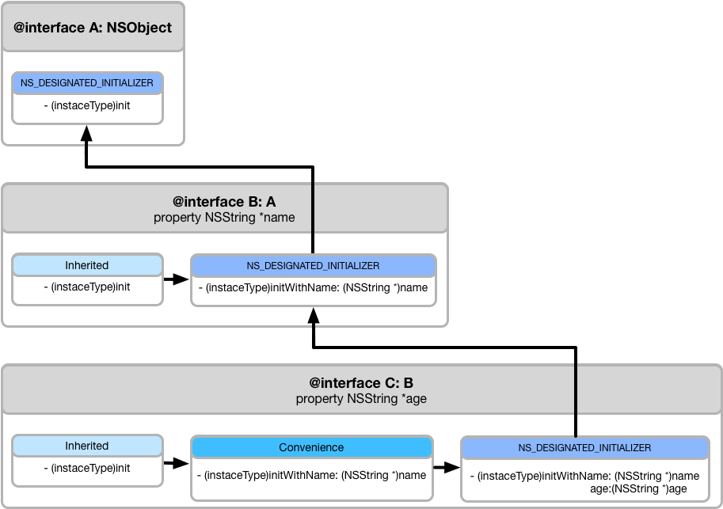
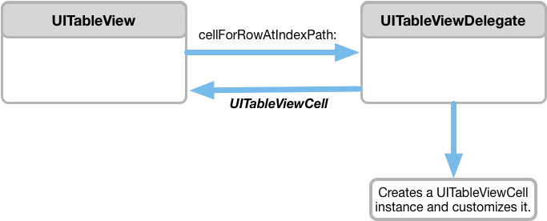
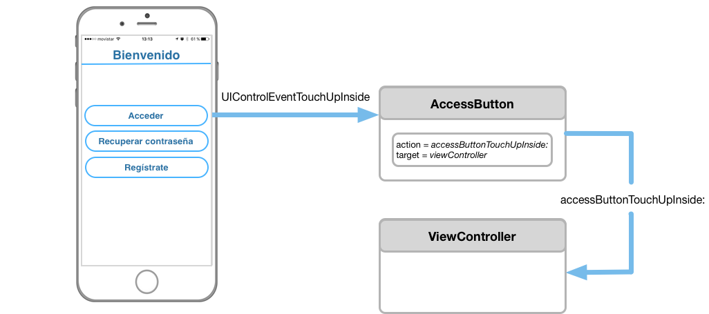
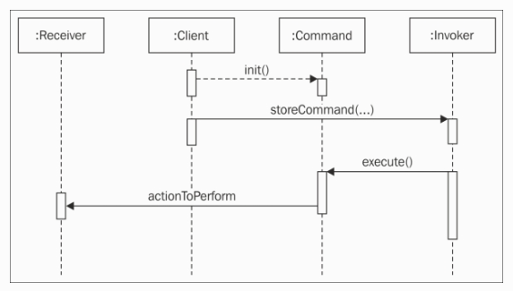

# Design Patterns

## Object Initialization

Initialization sets the instance variables of an object to reasonable and useful initial values. It can also allocate and prepare other global resources needed by the object. Every object that declares instance variables should implement an initializing method—unless the default set-everything-to-zero initialization is sufficient. If an object does not implement an initializer, Cocoa invokes the initializer of the nearest ancestor instead.

Cocoa allows declare multiple initializers, with one or more parameters, which are instance methods that begin with **init** and return an object of the dynamic type *id* in Objective-C, and an object of specific class in Swift.

Here are a few examples of initializers:

**Objective-C** 

```objectivec
- (instancetype)initWithFrame:(NSRect)frameRect;
- (instancetype)initWithTimeInterval:(NSTimeInterval)secsToBeAdded sinceDate:(NSDate *)date;
```

**Swift**

```swift
init(frame: CGRect)
init(timeInterval secsToBeAdded: TimeInterval, since date: Date)
```	

### Designated and Convenience initializers

The designated initializer plays an important role for a class. It ensures that inherited instance variables are initialized by invoking the designated initializer of the superclass. It is typically the init...` method that has the most parameters and that does most of the initialization work, and it is the initializer that secondary initializers of the class invoke with messages to self.

The designated initializer pattern helps ensure that inherited initializers properly initialize all instance variables. A subclass that needs to perform nontrivial initialization should override all of its superclass’s designated initializers, but it does not need to override the convenience initializers.

In **Objective-C**, object initialization is based on the notion of a *designated initializer*, an initializer method that is responsible for calling one of its superclass’s initializers and then initializing its own instance variables. Initializers that are not designated initializers are known as *convenience initializers*. Convenience initializers typically delegate to another initializer—eventually terminating the chain at a designated initializer—rather than performing initialization themselves.

To clarify the distinction between designated and designated initializers clear, you can add the `NS_DESIGNATED_INITIALIZER` macro to any method in the init family, denoting it a designated initializer. Using this macro introduces a few restrictions:

* The implementation of a designated initializer must chain to a superclass init method (with `[super init...]`) that is a designated initializer for the superclass.
* The implementation of a convenience initializer (an initializer not marked as a designated initializer within a class that has at least one initializer marked as a designated initializer) must delegate to another initializer (with [self init...]).
* If a class provides one or more designated initializers, it must implement all of the designated initializers of its superclass.

If any of these restrictions are violated, you receive warnings from the compiler.

If you use the `NS_DESIGNATED_INITIALIZER` macro in your class, you need to mark all of your designated initializers with this macro. All other initializers will be considered to be convenience initializers.

Example:

```objectivec
- (instancetype)initWithName:(NSString *)name NS_DESIGNATED_INITIALIZER;
- (instancetype)init;
```

The figure below shows the overall initializer chain for all three classes:



In **Swift**, *designated initializers* are the primary initializers for a class. A designated initializer fully initializes all properties introduced by that class and calls an appropriate superclass initializer to continue the initialization process up the superclass chain.

Classes tend to have very few designated initializers, and it is quite common for a class to have only one. Designated initializers are “funnel” points through which initialization takes place, and through which the initialization process continues up the superclass chain.

Every class must have at least one designated initializer. In some cases, this requirement is satisfied by inheriting one or more designated initializers from a superclass.

*Convenience initializers* are secondary, supporting initializers for a class. You can define a convenience initializer to call a designated initializer from the same class as the convenience initializer with some of the designated initializer’s parameters set to default values. You can also define a convenience initializer to create an instance of that class for a specific use case or input value type.

You do not have to provide convenience initializers if your class does not require them. Create convenience initializers whenever a shortcut to a common initialization pattern will save time or make initialization of the class clearer in intent.

There is a private word to use when an initializer is a convenience one, and this word is `convenience`. Designated initializers do not use any reserved word to denote it.

Example:

```	swift
init(name: String) {
	...
}
	
convenience init() {
	self.init(name: "The name")
} 
```

In Swift, the initializer chain looks like the figure below:


## Delegation

**Delegation** is a pattern in which one object in a program acts on behalf of, or in coordination with, another object. The delegating object keeps a reference to the other object `the delegate` and at the appropiate time sends a message to it. The message informs the delegate of an event that the delegating object is about to handle or has just handled. The delegate may respond to the message by updating the appearance or state of itself or other objects in the application, and in some cases it can return a value that affects how an impending event is handled. Delegation makes it possible for one object to after the behaviour of another object without the need to inherit from it. The delegate is almost always one of your custom objects, an by definition it incorporates application-specific logic that the generic and delegating object cannot possibly know itself.

### How does it work?

The delegating class has a property, usually named `delegate`, and declares, without implementing, one or more methods that constitute a *formal protocol* or an *informal protocol*.

>* A **formal protocol** declares a list of methods that client classes are expected to implement. Formal protocols have their own declaration, adoption, and type-checking syntax. You can designate methods whose implementation is required or optional. 

>* An **informal protocol** is a category on NSObject, which implicitly makes almost all objects adopters of the protocol. Implementation of the methods in an informal protocol is optional. Before invoking a method, the calling object checks to see whether the target object implements it. A clear example of informal protocol, is UIapplicationDelegate. Its methods are implemented by AppDelegate class of the application.

> To find more infomation about *Protocol*, [click here](https://developer.apple.com/library/content/documentation/General/Conceptual/DevPedia-CocoaCore/Protocol.html).

In the informal protocol approach, the delegate implements only those methods in wich it has an interest in coordinating itself with the delegating object or affecting that object's default behaviour. If the delegating class declares a formal protocol, the delegate may choose to implement those methods marked optional, but it must implement the required ones.

The mechanism of delegation is illustrated by the next figure:



### The form of delegation messages

Delegating methods have a conventional form. They begin with the name of the class object doing the delegating. Usually this object name is followeb by an auxiliary verb indicative of the tempral status of the reported event. This verb, in other words, indicates wheter the event is about to occur (*Should* or *Will*) or whether it has just occurred (*Did* or *Has*). This temporal distinction helps to categorize those messages that expect a return value and those that do not. 

Delegation methods with return values

```objectivec
//NSApplication
- (BOOL)application:(NSApplication *)sender openFile:(NSString *)filename; 
	
//UIApplicationDelegate
- (BOOL)application:(UIApplication *)application handleOpenURL:(NSURL *)url;

//UITableViewDelegate
- (UITableRowIndexSet *)tableView:(NSTableView *)tableView willSelectRows:(UITableRowIndexSet *)selection;

//NSWindow
- (NSRect)windowWillUseStandardFrame:(NSWindow *)window defaultFrame:(NSRect)newFrame;
```

The delegate that implements these methods can block the impending event (by returning *NO* in the first two methods), or alter a suggested value (the index set and the frame rectangle in the last two methods).

Other delegation methods are invoked by messages that do not expect a return value and so are typed to return *void*. These messages are purely informational, and the method names often contain *Did*, *Will*, or some other indication of a transpired or impending event.

```objectivec
//NSWindow 
- (void)windowDidMove:(NSNotification *)notification; 

//UIApplication	
- (void)application:(UIApplication *)application willChangeStatusBarFrame:(CGRect)newStatusBarFrame;

//NSApplication
- (void)applicationWillBecomeActive:(NSNotification *)notification;
```

## Target-Action

A typical application's user interface consists of a number of graphical objects, and perhaps the most common of these objects are controls. A control is a graphical analog of a real-world or logical device (button, switch, textfield...). As with real-world control, such as radio tuner, you use it to convey your intent to some system of which it is a part-that is, an application.

The role of a control on a user interface is simple: it interprets the intent of the user and instructs some other objects to carry out that request. When a user acts on the control by, say, clicking it or pressing the *Return key*, the hardware device generates a raw event. The control accepts the event and translates it into an instruction that is specific to the application. However, events by themselves do not give much information about the user's intent, they marely tell you that the user clicked a mouse button or pressed a key. So some mechanism must be called upon to provide the translation between event and instruction. This mechanism is called **target-action**.

Cocoa uses the target-action mechanism for communication between a control and another object. This mechanism allows the control and to encapsulate the information necessary to send an application-specific instruction to the appropiate object. The receiving object is called the `target`. The `action` is the message that the control sends to the target. The object that is interested in the user event `-the target-`is the one that imparts significance to it, and this significance is usually reflected in the name it gives to the action.



### The target

A target is a receiver of an action message. A control holds the target of its action message as an outlet. The target usually is an instance of one of yout custom classes, although it can be any Cocoa object whose class implements the appropiate action method.

Control objects do not retain their targets. However, clients of controls sending action messages are responsible for ensuring that their targets are available to receive action messages. To do this, they may have to retain their targets in memory-managed environments. 

### The action

An action is the message a control sends to the target or, from the perspective of the target, the method that the target implements to respond to the action message. A control stores an action as an instance variable of type `SEL -Objective-C-` or `Selector -Swift-`, -data types used to specify the signature of a message-. An action message must have a simple, distinct signature. The method it invokes returns nothing and usually has a parameter containing the object sending the message. This parameter, by convention, is named *sender*.

Example of action methods with one, two or three parameters:

**Objective-C**

```objectivec	
- (void)doSomething;
- (void)doSomething:(id)sender;
- (void)doSomething:(id)sender forEvent(UIEvent *)event;
```
**Swift**

```swift
func doSomething()
func doSomething(sender: UIButton)
func doSomething(sender: UIButton, forEvent event: UIEvent)
```

Action methods declared by some Cocoa classes can also have the equivalent signature:

**Objective-C**

```objectivec	
- (IBAction)doSomething:(id)sender;
- (IBAction)doSomething:(id)sender forEvent(UIEvent *)event;
```

**Swift**

```swift	
@IBAction func doSomething(sender: UIButton)
@IBAction func doSomething(sender: UIButton, forEvent event: UIEvent)
```

In this case, `IBAction` does not designate a data type for a return value, no value is returned. *IBAction* is a type qualifier that Interface Builder notices during application development to synchronize actions added programmatically with its internal list of action methods defined for a project.

The sender parameter usually identifies the control sending the action message. The target can query the sender for more information if it needs to. If the actual sending substitutes another object as sender, you should treat that object in the same way. 

## Observation 

### Key-Value Observing (KVO)

Key-value Observing, `<NSKeyValueObserving>, or KVO`, is an informal protocol that defines a common mechanism that allows objects to be notified of changes to specified properties of other objects. As an informal protocol, classes do not conform to it, it's just implicitly assumed for all subclasses of `NSObject`.

KVO's primary benefit is that you do not have to implement your own scheme to send notifications every time a property changes. Its well-defined infrastructure has framework-level support that make it easy to adopt. In addition, the infrastructure is already full-featured, which makes it easy to support multiple observers for a single property, as well as dependent values.

To use KVO, first you must ensure that the observed object is *KVO Compliant*. If your objects inherit from *NSObject* and you create properties in the usual way, your objects and their preoperties will automatically be KVO Compliant. It is also possible to implement compliance manually. [**KVO Compliance**](https://developer.apple.com/library/content/documentation/Cocoa/Conceptual/KeyValueObserving/Articles/KVOCompliance.html#//apple_ref/doc/uid/20002178-BAJEAIEE) describes the difference between automatic and manual key-value observing, and how to implement both.


#### Registering as an Observer

An observing object first registers itself with the observed object by sending an `addObserver:forKeyPath:options:context` message, passing itself as the observer and the key path of the property to be obsrved. The observer additionally specifies an options parameter and a context pointer to manage aspects of the notifications.

```objectivec
- (void)addObserver:(NSObject *)observer 
         forKeyPath:(NSString *)keyPath 
            options:(NSKeyValueObservingOptions)options 
            context:(void *)context;
```
> * `observer`: The object to register for KVO notifications. The observer must implement the key-value observing method *observeValueForKeyPath:ofObject:change:context:*
> * `keyPath`: The key path, relative to the receiver, of the property to observe. This value must not be *nil*.
> * `options`: A combination of the [NSKeyValueObservingOptions](https://developer.apple.com/reference/foundation/nskeyvalueobservingoptions?language=objc) values that specifies what is included in observation notifications. 
> * `context`: Arbitrary data that is passed to `observer` in *observeValueForKeyPath:ofObject:change:context:*

#### Receiving notification of a change

When the value of an observed property of an object changes, the observer receives an *observeValueForKeyPath:ofObject:change:context:* message. All observers must implement this method.

The observing object provides the key path that triggered the notification, itself as the relevant object, a dictionary containing details about the change, and the context pointer that was provided when the observer was registered for this key path.

A typical implementation of this method looks something like this:

```objectivec
- (void)observeValueForKeyPath:(NSString *)keyPath
                      ofObject:(id)object
                        change:(NSDictionary *)change
                       context:(void *)context {
 
    if ([keyPath isEqualToString:@"name"]) {
        //...
 
    } else {
        // Any unrecognized context must belong to super
        [super observeValueForKeyPath:keyPath
                             ofObject:object
                               change:change
                               context:context];
    }
}
```
In any case, the observer should always call the superclass's implementation of *observeValueForKeyPath:ofObject:change:context:* when it does not recognize the context or the key path, because this means a suplerclass has registered for notifications as well.

> **Note**: If a notification propagates to the top of the class hierarchy, *NSObject* throws a *NSInternalInconsistencyException* because this is a programming error: a subclass failed to consume a notification for which is registered.

#### Removing an Object as an Observer

You remove a key-value observer by sending the observed object a *removeObserver:forKeyPath:context:* message, specifiying the observing object, the key path, and the context. 

After receiving a *removeObserver:forKeyPath:context:* message, the observing object will no longer receive any *observeValueForKeyPath:ofObject:change:context:* messages for the specified key path and object.

If you make a call to *removeObserver:forKeyPath:context:* when the object **is not registered* as an observer (whether because it was already unregistered or not registered in the first place), an exception is thrown. The kicker is that *there is no built-in way to even check if an object is registered*. So, the best option is to invoke *removeObserver:forKeyPath:context:* inside `@try @catch` block.

```objectivec
@try {
	[object removeObserver:self
			  	  forKeyPath:"name"];
}
@catch (NSException * __unused exception) {}
```

### NSNotificationCenter

An `NSNotificationCenter`object (or simply, **notification center**) provides a mechanism for bradcasting information within a program. An NSNotificationCenter object is essentially a notification dispatch table.

NSNotificationCenter provides a centralized hub through which any part of an application may notifiy and be notified of changes from any other part of the application. Observers register with a notification center to respond to particular events with a specified action. Each time an event occurs, the notification goes through its dispatch table, and messages any registered observers for that event.

Each NSNotification object has a *name*, with additional context optionally provided by an associated *object* and *userInfo* dictionary.

#### Adding observers

The traditional way to add an observer is calling `addObserver:selector:name:object:` of NSNotificationCenter, in which an object, usually `self`, adds itself to have the specified selector performed when a matching notification is posted.

The modern, block-bassed API for adding notification observers is `addObserverForName:object:queue:usingBlock`. Instead of registering an existing object as an observer of a notification, this method creates its own anonymous object to be the observer, which performs a block on the specified queue (or the calling thead, if *nil*) when a matching notification is posted. Unlike its similary named *@selector*-based counterpart, this method actually returns the constructed observer object, which is necessary for unregistering the observer.

The `name` and `object` parameters of both methods are used to decide whether the criteria of a posted notification match the observer. If *name* is set, only notifications with that name will trigger, but if *nil* is set, then *all names* will match. The same is true of *object*. So, if both, *name* and *object* are set, only notifications with that name and the specified object will trigger. However, if both are nil, then all notifications posted will trigger.

**Objective-C**

```objectivec
NSNotificationCenter *center = [NSNotificationCenter defaultCenter];
NSOperationQueue *mainQueue = [NSOperationQueue mainQueue];
_localeChangeObserver = [center addObserverForName:NSCurrentLocaleDidChangeNotification object:nil
    queue:mainQueue usingBlock:^(NSNotification *note) {
 
        NSLog(@"The user's locale changed to: %@", [[NSLocale currentLocale] localeIdentifier]);
    }];
```
**Swift**

```Swift
let center = NSNotificationCenter.defaultCenter()
let mainQueue = NSOperationQueue.mainQueue()
self.localeChangeObserver = center.addObserverForName(NSCurrentLocaleDidChangeNotification, 
	object: nil, queue: mainQueue) { (note) in
    
    print("The user's locale changed to: \(NSLocale.currentLocale().localeIdentifier)")
}
```

#### Removing observers

It is important for objects to remove observers before they are deallocated, in order to prevent further messages from being sent.

There are two methods for removing observers:`removeObserver:` and `removeObserver:name:object:`. Again, just as with adding observers, *name* and *object* are used to define scope. *removeObserver:*, or *removeObserver:name:object:* with `nil`for both parameters, will remove the observer form the notification center dispatch table entirely, while specifying parameters for *removeObserver:name:object:* will only remove the observer for registrations with that name and/or object.

#### Posting notifications

In addition to subscribing to system-provided notifications, applications may want to publish and subscribe to their own.

Notificatiosn are created with `+notificationWithName:object:userInfo:`.

Notification names are generally definedas strings constants. Like any string constant, it should be declared `extern` in public interface, and defined privately in the corresponding implementation. It does not matter to much what a notification name's value is defined to be, the name of the variable itself is commonplace, but a reverse-DNS identifier is also a classy choice. So long as notification names are unique (or explicity aliased), everything will work as expected.

Notifications are posted with `postNotificationName:object:userInfo:` or its convenience method `postNotificationName:object:, which passes *nil* for *userInfo*.

Since notification dispatch happens on the posting thread, it may be necessary to `dispatch_async`to `dispatch_get_main_queue()` so that a notification is handled on the main thread. This is not usually necessary, but it is important to keep in mind.

### KVO != NSNotificationCenter

**Key-Value Observing** adds observers for keypaths, while **NSNotificationCenter** adds observers for notifications.


## Factory (Class clusters)

**Class clusters** are a design pattern that the Foundation framework makes extensive use of. Class clusters group a number of private concrete subclasses under a public abstract superclass. The grouping of classes in this way simplifies the publicly visible architecture of an object-oriented framework without reducing its functional richness. Class clusters are based on the [Abstract Factory](https://sourcemaking.com/design_patterns/abstract_factory) design pattern.

It is an architecture that groups a number of private, concrete subclasses under a public, abstract superclass. The grouping of classes in this way provides a simplified interface to the user, who sees only the publicly visible architecture. The abstract class is calling up the private subclass most suited for performing a particular task. For example, several of the common Cocoa classes are implemented as class custers, including `NSArray`, `NSString`, and `NSNumber`. There are many ways in which they can represent their internal data storage. For any particular instance, the abstract class chooses the most efficient class to use based on the data that instance is being initialized with.

You create and interact with instances of the cluster just as you would any other class. Behind the scenes, though, when you create an instance of the public class, the class returns an object of the appropiate sublcass based on the creation method that you invoke. But, you do not, and cannot, choose the actual class of the instance.

### Design

The **Abstract Factory pattern** is designed to build objects grouped in families without having to know the concrete class needed to create the object.

This pattern is generally used in the following domains:

* A system that uses products needs to stay independent of how these products are grouped and instantiated.
* A system can have several product families that can evolve.

The following diagram represents the generic structure. You will see how products and families are decoupled.


* `Abstract Factory`: This abstract class defines the signature of the different methods that create out products.
* `Concrect Factory 1` and `Concrect Factory 2`: These are our concrete classes that implement our methods for each product's families. By knowing the family and product, the factory is able to create an instance of the product for that family.
* `IProductA` and `IProductB`: These are our interfaces that define our products that are independent of their family. A family is introduced in their concrete subclasses.
* `ProductA` and `ProductB`: These are the concrete classes that implement _IProductA_ and _IProductB_, respectively.

### Example

Consider the problem of constructing a class hierarchy that defines objects to store numbers of different types: `char, int, float, double`. Because numbers of different types have many features in common (they can be converted from one type to another and can be represented as strings, for example), they could be represented by a single class. However, their storage requirements differ, so it is inefficient to represent them all by the same class. Taking this fact into consideration, to solve the problem, the class architecture could be designed like:
 

 
**Number** is the abstract superclass that declares in tis methods the common operations for its subclasses. However, it does not declare an instance variable to store a number. The subclasses declare such instance variables and share in the programatic interface declared by **Number**.

So far, this design is relatively simple. However, if the commonly used notifications of these basic C types are taken into account, the class hierarchy diagrams looks more like;
 


Applying the **class cluster design pattern** to this problem generates the next class hierarchy:
 
  

Users of this hierarchy see only one public class, `Number`.
 
The abstract superclass in a class cluster must declare methods for creating instances of its private sublcasses. It is the superclass's responsibility to dispense an object of the proper sublcass based on the creation method that you invoke. You *do not* and *cannnot* choose the class of the instance.

```objectivec
NSNumber *char = [NSNumber numberWithChar: 'a'];
NSNumber *int = [NSNumber numberWithInt: 1];
NSNumber *float = [NSNumber numberWithFloat: 1.0];
NSNumber *double = [NSNumber numberWithDouble: 1.0];
...
```

### Benefits

The benefit of a class cluster is primarily efficiency. The internal representation of the data that an instance manages can be tailored to the way it is created or being used. Moreover, the code you write will continue to work even if the underlying implementation changes.

### Considerations

Its architecture involves a trade-off between simplicity and extensibility: Having a few public classes stand in for a multitude of private ones makes it easier to learn and use the classes in a framework but somewhat harder to create subclasses within any of the clusters.

A new class that you create within a class cluster must:

* Be a subclass of the cluster's abstract superclass.
* Declare its own storage.
* Override the superclass's primitive methods.

If it is rarely necessary to create a subclass the the cluster architecture is clearly beneficial. You might also be able to avoid subclassing by using composition; by embedding a private cluster object in an object of your own design, you create a composite object. This composite object can rely on the cluster object for its basic functionallity, only intercepting messages that it wants to handle in some particular way. Using this approach reduces the amount of code you must write and lets you take advantage of the tested code provided by the Foundation Framework.

## Prototype

The **Prototype pattern** is used to create a new object by duplicating existing objects called *prototypes*, and they have a cloning capability.

This pattern is used in the folowwing use cases:

* When you need to create an instance without knowing the hierarchy of a class.
* When you need to create class isntances that are dynamically loaded.
* When you need to have a simple object system and not include parallel hierarchy of a factory class.


* `Client`: This class contains a list of objects called prototypes that are instances of the *AbstractPrototype* abstract calss. The *Client* class needs to clone these prototypes without having to know their internal structure and subclass hierarchy.
* `AbstractPrototype`: This is an abstract class that can duplicate itself. This class contains a clonning method called `clone()`.
* `ConcretePrototype1`and `ConcretePrototype2`: These are concrete classes that inherit form the *AbstractPrototype* class. They define a prototype and have both cloning method called `clone()`.

**Foundation** has a protocol named `NSCopying` which declares a method for providing functional copies of an object. The exact meaning of *copy* can vary from class to class, but a copy must be a functionally independent object with values identical to the original at the time the copy was made. A copy produced with **NSCopying** is implicitly retained by the sender, who is responsible for releasing it.

NScopying declares one method, `copyWithZone:`, but copying is commonly invoked with the convenience method `copy`. The *copy* method is defined for all objects inheriting form NSObject and simply invokes *copyWithZone:* with the default zone.

Your options for implementing this protocol are as follows:

* Implement NSCopying using `alloc`and `init...` in classes that do not inherit `copyWithZone:`.
* Implement NScopying by retaining the original instead of creating a new copy when the class and its contests are inmutable.

If a subclass inherits NSCopying form its suplerclass and declares additional instance variables, the subclass has to override `copyWithZone:`to properly handle its own instance variables, invoking the superclass's implementation first.

#### Example

```swift
class Person: NSObject, NSCopying {
    var name: String
    var age: Int
    
    init(withName name: String, age: Int) {
        self.name = name
        self.age = age
    }
    
    init(_ person: Person) {
        name = person.name
        age = person.age
    }
    
    func copy(with zone: NSZone? = nil) -> Any {
        return Person(self)
    }
}
```

## Command

The concept behind this pattern is to transform a request into an object in order to facilitate some actions, such as undo/redo, inserto into a queue, or tracking of the request.

The command pattern creats distance between the client that requests an operation and the object that can perform it. The request is encapsulated into an object. This object contains a reference to the reciver who will effectively execute the operation.

The real operation is managed by the receiver and the command is like an order; it only contains a reference to the invoker, the object that will perform the action and an execute function will call the real operation on the worker. 

This pattern allows the following features:

* Sending requests to different receivers
* Queuing, logging, and rejecting requests
* Undoable actions
* Encapsulate a request in an object
* Allows the parametrization of clients with different requests


The classes participating in this pattern are as follows:

* `Command`: This declares the interface for executing an operation
* `ConcreteCommand`: This implements the *Command* interface with the execute method by invoking the corresponding operations on *Receiver*. It defines a link between the *Receiver* class and the action.
* `Client`: This creates a *ConcreteCommand* object and sets its receiver.
* `Invoker`: This asks the command to carry out the request.
* `Receiver`: This knows how to perform the operations.

### How does it works?

The following sequence diagram defines the collaboration between all objects participating in the command pattern:



* The client asks for a command to be executed and specifies its receivers.
* The client then sends the command to the invoker that stores it (or places it in a queue system if some actions needs to be performed before execution of the command) in order to execute it later.
* The invoker is then called to launch the command by infoking the execute function on the appropiate command object.
* The concrete command asks the reciver to execute the appropiate operation.

### Objective-C NSInvocation

Command pattern is well-built in Objective-C with the class **NSInvocation**. 

An `NSInvocation`is an Objective-C message rendered static, that is, it is an action turned into an object. *NSInvocation* objects are used to store and forward messages between applications, primarily by [NSTimer](https://developer.apple.com/reference/foundation/timer) objects and the distributed objects system.

An NSInvocation object contains all the elements of an Objective-C message: a target, a selector, arguments, and the return value. Each of these elements can be set directly, and the return value is set automatically when the NSInvocation object is dispatched.

It can be repeatedly dispatched to different targets; its arguments can be modified between dispatch for vaying results; even its selector can be changed to another with the same method signature (arguments and return types). This flexibility makes NSInvocation useful for repeating messages with many arguments and variations; rather than retyping a slightly different expression for each message, you modify the NSInvocation object as needed each time before dispatching it to a new target.

In order with the *Command pattner* workflow, the `client` will create a **NSInvocation** instance with all the information that it need: target (it will be the `receiver` ), selector, and arguments, and then execute the invocation.

> More information about NSInvocation in this [article](http://cocoamental.com/2011/06/28/nsinvocation-para-torpes/).

## Extensions

Sometimes, you may find that you wish to extend an existing class by adding behavior that is useful only in certain situations. As an example, you might find that your application often needs to display a string of characters in a visual interface. Rather than creating some string-drawing object to use every time you need to display a string, it would make more sense if it was possible to give the NSString class itself the ability to draw its own characters on screen.

In situations like this, it does not always make sense to add the utility behavior to the original, primary class interface. Drawing abilities are unlikely to be needed the majority of times any string object is used in an application, for example, and in the case of NSString, you cannot modify the original interface or implementation because it is a framework class.

However, Objective-C allows you to add your own methods to existing classes through **categories and class extensions**, and **extensions** in Swift.

### Objective-C categories

In order to add a method to an existing class, the easiest way is to use a **category**. 

A category can be declared for any class, even if you do not have the original implementation source code (such as for standard Cocoa or Cocoa Touch classes). Any methods that you declare in a category will be available to all instances of the original class, as well as any sublcasses of the original class. At runtime, there is no difference between a method added by a category and one that is implemented by the original class.

The syntax to declare a **category** used the `@interface` keyword, just like a standard Objective-C class description, but does not indicate any inheritance from a subclass. Instead, it specified the name of the category in parentheses, like this:

```objective-c
@interface ClassName (CategoryName)

@end
```

A category is usually declared in a separate header file and implemented in a separate source code file, so you should have a `.h` and a `.m` files.

```objectivec
//NSString+Utils.h

@interface NSString (Utils)

- (NSString *)nonEmptyString;

@end

//NSString+Utils.m

#import NSString+Utils.h

@implementation NSString

- (NSString *)nonEmptyString {
	
	return ([self length] == 0) ? "" : self;

}

@end
```

Categories can be used to declare either instane methods or class methods but are not usually suitable for declaring additional properties. It is valid syntax to include a property declaration in a category interface, but it is not possible to declare an additional instance variable in a category. This means the compiler will not synthesize any instance variable, nor will it synthesize any property accessor methods. You can write your own accessor methods in the category implementation, but you will not be able to keep track of a value for that property unless it is already stored by the original class.

Any methods added by a category are available to all instances of the class and its subclasses, you will need to import the category header file in any source code file where you wish to use the additional methods, otherwise you will run into compiler warnings and errors.

```objectivec
#import NSString+Utils.h

@implementation SomeObject

- (void)someMethod {

	NSString *nonEmptyName = [_name nonEmptyString];
	
	NSLog(@"The name is %@", nonEmptyName)
} 
```

### Objective-C class extensions

A class extension bears some similarity to a category, but it can only be added to a class for which you have the source code a compile time. The methods are declared by a class extension are implemented in the `@implementation` block for the original class so you cannot, for example, declare a class extension on a framework class, suchs as a Cocoa or Cocoa Touch class like *NSString*.

The syntax to declare a class extension is similar to hte syntax for a category, and looks like this:

```objectivec
//.m file

@interface ClassName()

@end
```

Because no name is given in the parentheses, class extensions are often referred to as *anonymous categories*.

Unlike regular categories, a class extension can add its own properties and instance variables to a class. If you declare a property in a class extension, like this:

```objectivec
@interface ClassName()

@property (nonatomic, readwrite, copy) NSString *privateProperty;

@end
```
the compiler will automatically synthesize the relevant accessor methods, as well as an instance variable, inside the primary class implementation.

If you add any methods, these must be implemented in the primary implementation for the class.

**Class extensions** are often used to extend the public interface with additional private methods or/and properties for use within the implementation of the class itself. It is common, for example, to define a property `readonly` in the interface, but `readwrite` in a class extension declared above the implementation, in order that the internal methods of the class can change the property value directly.

### Swift extensions

`Extensions` add new functionality to an existing class, structure, enumeration, or protocol type. This includes the ability to extend types for which you do not have access to the original source code (known as *retroactive modeling*). Extensions are similar to categories in Objective-C, and do not have names.

Extensions in Swift can:

* Add computed instance properties and computed type properties
* Define instance methods and type methods
* Provide new initializers
* Define subscripts
* Define and use nested types
* Make an existing type conform to a protocol

You can even [**extend a protocol**](https://developer.apple.com/library/content/documentation/Swift/Conceptual/Swift_Programming_Language/Protocols.html#//apple_ref/doc/uid/TP40014097-CH25-ID521) to provide implementations of its requirements or add additional functionality that conforming types can take advantage of. 

One important thing, *Extensions* can add new functionality to a type, but they **cannot override existing funcitonality**.

To declare an extension of a given type, you msut use the `extension` keyword

```swift
extension TypeName {
	// new functionality to add to TypeName goes here
}
```
An extension can extend an existing type to make it adopt one or more protocols. Where this is the case, the protocol names are written in exactly the same way as for a class or structure:

```swift
extension TypeName: SomeProtocol, AnotherProtocol {
	//implementation of protocol requirements goes here
}
```

In addition, you can declare `private` extensions to make methods and/or computed properties only accesible to the type owner.

```swift
private extension TypeName {
	// private implementation of TypeName goes here
}
```

> **Note**: If you define an extension to add new functionality to an existing type, the new functionality will be available on all exisiting instances of that type, even if they were created before the extensions was defined.

For more information of Swift Extensions, visit [Apple Documentation](https://developer.apple.com/library/content/documentation/Swift/Conceptual/Swift_Programming_Language/Extensions.html).

## Dependency injection

A powerful mechanism for separating construction from use is **Dependency Injection**, *DI*, the application of *Inversion of Control (IoC)* to dependecy management. Inversion of Control moves secondary responsibilities from an object to another objects that are dedicated to the purpose, thereby supporting the [*Single Responsibility Principle*](http://www.butunclebob.com/ArticleS.UncleBob.PrinciplesOfOod). In the context of dependecy management, an object should not take responsibility for instantiating dependencies itself. Instead, it should pass this responsibility to another authoritative mechanism, thereby inverting the control. Because setup is a global concern, this authoritative mechanism will usually be either the main routine or a special-purpose container.

The invoking object does not control what kind of object is actually returned (as long it implements the appropiate interface), but the invoking object still actively resolves the dependency.

True *Dependency Injection* goes on step further. The class take no direct steps to resolve its dependencies; it is completely passive. Instead, it provides setter method of constructor arguments (or both) that are used to *inject* the dependencies. During the construction process, the DI container instantiates the required objects (usually on demand) and uses the constructor arguments or setter methods provided to wire together the dependencies. Which dependent objects are actually used is specified through a configuation file or programmatically in a special-purpose construction module.

### Constructor injection

> **Note**: iOS does not have constructors, it has initializers, but **constructor** is a standard DI term, and it is easier to look up accross the languages.
 
In constructor injection, a dependency is passed into the constructor (the designated initializer) and captured for later use:

```objectivec
@interface Example ()

@property (nonatomic, strong, readonly) NSUserDefaults *userDefaults;

@end

@implementation Example

- (instancetype)initWithUserDefaults:(NSUserDefaults *userDefaults) {
    
    self = [super init];
    
    if (self) {
        _userDefaults = userDefaults;
    }
    
    return self;
}

@end
```

The dependency can be captured in an instance variable or in a property. Now every place in this class that would refer to the singleton `[NSUserDefaults standardUserDefaults]` should instead refer to `self.userDefaults` or `_userDefaults`:

```objectivec
- (NSNumber *)nextReminderId {
    
    NSNumber *currentReminderId = [self.userDefaults objectForKey:@"currentReminderId"];
    
    if (currentReminderId) {
        currentReminderId = @([currentReminderId intValue] + 1);
    } else {
        currentReminderId = @0;
    }
    
    [_userDefaults setObject:currentReminderId forKey:@"currentReminderId"];
    
    return currentReminderId;
}
```

### Property injection

In property injection, the code for `nextReminderId` looks the same, referring to `self.userDefaults`. But instead of passing the dependency to the initializer, we make it a settable property:

```objectivec
@interface Example

@property (nonatomic, readwrite, strong) NSUserDefaults *userDefaults;

- (NSNumber *)nextReminderId;

@end
```

What should happen if the property is not set? In that case, let’s use lazy initialization to establish a reasonable default in the getter:

```objectivec
- (NSUserDefaults *)userDefaults {
   
    if (!_userDefaults) {
        _userDefaults = [NSUserDefaults standardUserDefaults];
    }
   
    return _userDefaults;
}
```

Now, if any calling code sets the userDefaults property before it is used, `self.userDefaults` will use the given value. But if the property is not set, then `self.userDefaults` will use `[NSUserDefaults standardUserDefaults]`.

> More information about Dependency Injection:
> 
> * [Dependency Injection](https://www.objc.io/issues/15-testing/dependency-injection/)
> * [Dependency Injection, iOS and You](https://www.bignerdranch.com/blog/dependency-injection-ios/)