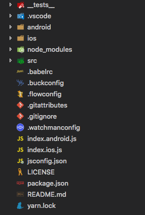
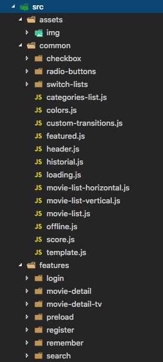
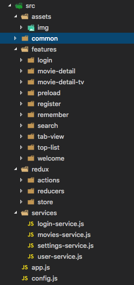
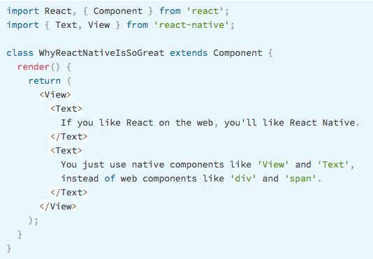
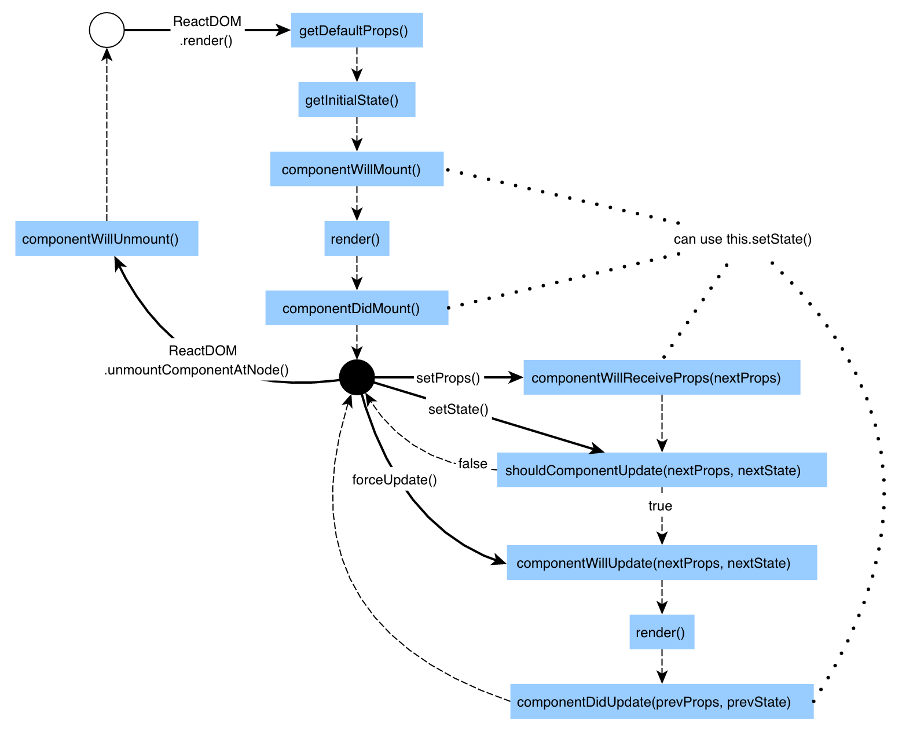
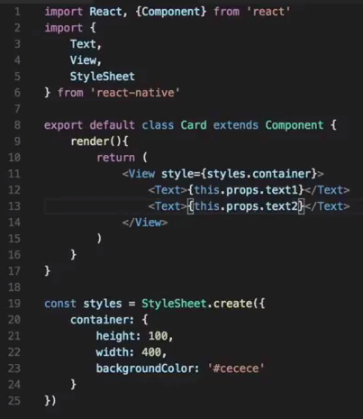
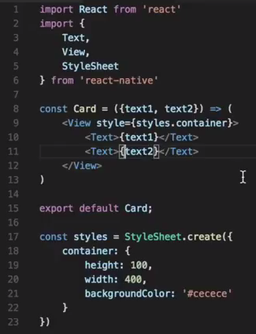
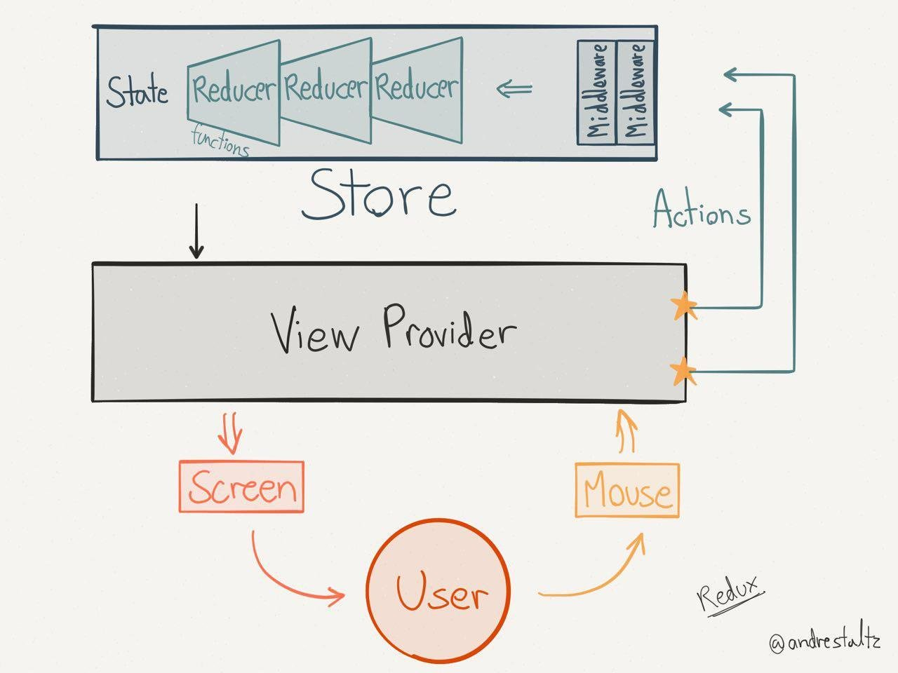

# React Native Style Guide


>React Native lets you build mobile apps using only JavaScript. It uses the same design as React, letting you compose a rich mobile UI from declarative components.

>With React Native, you don't build a “mobile web app”, an “HTML5 app”, or a “hybrid app”. You build a real mobile app that's indistinguishable from an app built using Objective-C or Java.

## Index

* [Structure and syntax](#structure-and-syntax)
* [Layout with Flexbox](#layout-with-flexbox)
* [Lifecycle](#lifecycle)
* [Class component vs function component](#class-component-vs-function-component)
* [Redux](#redux)
* [Testing](#testing)
* [Best practices](#best-practices)
* [Resources](#resources)

## Structure and syntax

 >~~Develop once, run everywhere~~

 >Learn once, write everywhere

### Structure

#### General directories:



#### Features, assets and common:



#### Redux and services:



#### Native directories:


### Syntax



## Layout with Flexbox

A component can specify the layout of its children using the flexbox algorithm. Flexbox is designed to provide a consistent layout on different screen sizes.

>You will normally use a combination of flexDirection, alignItems, and justifyContent to achieve the right layout.

[React Native Flexbox](https://facebook.github.io/react-native/docs/flexbox.html)

## Lifecycle

Each component has several “lifecycle methods” that you can override to run code at particular times in the process. Methods prefixed with will are called right before something happens, and methods prefixed with did are called right after something happens:



### Mounting

These methods are called when an instance of a component is being created and inserted into the DOM:

- constructor()
- componentWillMount()
- render()
- componentDidMount()

### Updating

An update can be caused by changes to props or state. These methods are called when a component is being re-rendered:

- componentWillReceiveProps()
- shouldComponentUpdate()
- componentWillUpdate()
- render()
- componentDidUpdate()

### Unmounting

This method is called when a component is being removed from the DOM:

- componentWillUnmount()

### Error Handling

This method is called when there is an error during rendering, in a lifecycle method, or in the constructor of any child component.

- componentDidCatch()

## Class component vs function component

Whenever possible, use components as functions.

#### Class component

It doesn't make sense, it just returns a template:

- Class
- Lifecycle
- States
- Props
- Styles



#### Function component

It doesn't make sense, it just returns a template:

- Props
- Styles



## Redux


>Redux is a predictable state container for JavaScript apps.

>It helps you write applications that behave consistently, run in different environments (client, server, and native), and are easy to test.

#### Three principle

1. Single source of truth: the state of your whole application is stored in an object tree within a single store

2. State is read-only: the only way to change the state is to emit an action, an object describing what happened

3. Changes are made with pure functions: to specify how the state tree is transformed by actions, you write pure reducers

#### Redux model



#### Store

Maintains the status of an application centrally:

- getState(): allows access to the state through
- subscribe(listener): registers subscriptions
- dispatch(action): allows state to be mapped via the  method

#### Saga


_redux-saga_ is a library that aims to make application side effects (i.e. asynchronous things like data fetching and impure things like accessing the browser cache) easier to manage, more efficient to execute, simple to test, and better at handling failures.

```Javascript
// sagas.js

import { call, put, takeEvery, takeLatest } from 'redux-saga/effects'
import Api from '...'

// worker Saga: will be fired on USER_FETCH_REQUESTED actions
function* fetchUser(action) {
   try {
      const user = yield call(Api.fetchUser, action.payload.userId);
      yield put({type: "USER_FETCH_SUCCEEDED", user: user});
   } catch (e) {
      yield put({type: "USER_FETCH_FAILED", message: e.message});
   }
}

/*
  Starts fetchUser on each dispatched `USER_FETCH_REQUESTED` action.
  Allows concurrent fetches of user.
*/
function* mySaga() {
  yield takeEvery("USER_FETCH_REQUESTED", fetchUser);
}

/*
  Alternatively you may use takeLatest.

  Does not allow concurrent fetches of user. If "USER_FETCH_REQUESTED" gets
  dispatched while a fetch is already pending, that pending fetch is cancelled
  and only the latest one will be run.
*/
function* mySaga() {
  yield takeLatest("USER_FETCH_REQUESTED", fetchUser);
}

export default mySaga;
```

```Javascript
// main.js

import { createStore, applyMiddleware } from 'redux'
import createSagaMiddleware from 'redux-saga'

import reducer from './reducers'
import mySaga from './sagas'

// create the saga middleware
const sagaMiddleware = createSagaMiddleware()
// mount it on the Store
const store = createStore(
  reducer,
  applyMiddleware(sagaMiddleware)
)

// then run the saga
sagaMiddleware.run(mySaga)

// render the application
```

## Testing


>Zero configuration testing platform.

[Jest](https://facebook.github.io/jest/) is the default testing framework for React and React Native and should be used along with

### Setup

The following configuration should be automatically added to your package.json file:

```Json
  // package.json

  "scripts": {
    "test": "jest"
  },
  "jest": {
    "preset": "react-native"
  }
```

### Location

Place your tests in a __tests__ folder, or name your test files with a .spec.js or .test.js extension

### Run Tests

Simply run npm test to run tests with Jest:

```Terminal
npm test
```

### Snapshot Test

How to use React's test renderer and Jest's snapshot feature to interact with the component and capture the rendered output and create a snapshot file:

```Javascript
// __tests__/Intro-test.js

import 'react-native';
import React from 'react';
import Intro from '../Intro';

// Note: test renderer must be required after react-native.
import renderer from 'react-test-renderer';

test('renders correctly', () => {
  const tree = renderer.create(<Intro />).toJSON();
  expect(tree).toMatchSnapshot();
});
```

### Mock native modules using jest.moc

Some react-native components or third party components rely on native code to be rendered. In such cases, Jest's manual mocking system can help to mock out the underlying implementation:

```Javascript
jest.mock('Text', () => {
  const RealComponent = require.requireActual('Text');
  const React = require('React');
  class Text extends React.Component {
    render() {
      return React.createElement('Text', this.props, this.props.children);
    }
  }
  Text.propTypes = RealComponent.propTypes;
  return Text;
});
```

### require react-native before the test renderer

Currently it is required to require react-native before loading the test renderer:

```Javascript
import 'react-native';
// Require after react-native
import renderer from 'react-test-renderer';
```

### @providesModule

If you'd like to use Facebook's @providesModule module system through an npm package, the default haste config option must be overwritten and npm modules must be added to providesModuleNodeModules:

```Json
"haste": {
  "defaultPlatform": "ios",
  "platforms": ["android", "ios"],
  "providesModuleNodeModules": [
    "react",
    "react-native",
    "my-awesome-module",
    "my-text-component"
  ]
},
```

## Best practices

- Structure and name space clean
- Write file name, classes and function with CamelCase
- Not use this.setState into the render() function
- Not use this.setState into the hooks function
- Use ES6 :)
- Use Component instances vs Component Classes
- Managing app state with Redux
- Use native animations with Animated
- Use component third's with native animations
- Testing the app ;)
- Documenting the app ;)

## Resources

**Learning React Native**

- https://facebook.github.io/react-native/
- https://github.com/jondot/awesome-react-native
- https://js.coach/react-native
- https://reactnavigation.org/
- http://microsoft.github.io/code-push/index.html
- http://www.reactnative.com/built-with-react-native/
- https://github.com/react-native-community/react-native-tab-view
- https://github.com/VctrySam
- https://trends.google.es/trends/explore?q=React.js,React%20Native
- https://play.google.com/apps/publish/signup/
- https://appiconizer.com/

**React Native Plugins**

- https://github.com/oblador/react-native-vector-icons
- https://github.com/AlexanderZaytsev/react-native-i18n
- https://github.com/react-native-component/react-native-smart-splash-screen
- https://github.com/ivpusic/react-native-image-crop-picker
- https://github.com/react-native-community/react-native-tab-view
- https://github.com/react-native-community/

**Testing React Native**

- http://facebook.github.io/jest/docs/en/getting-started.html
- http://facebook.github.io/jest/docs/en/tutorial-react-native.html