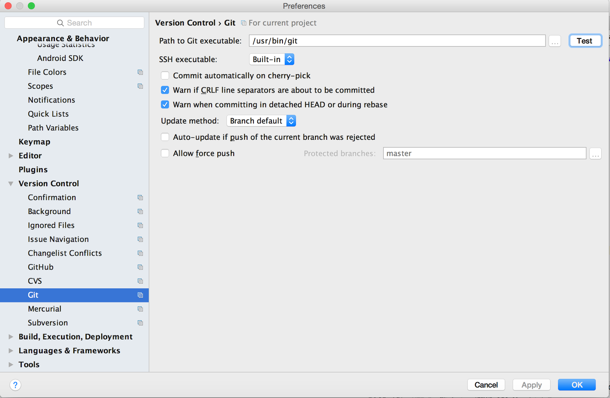
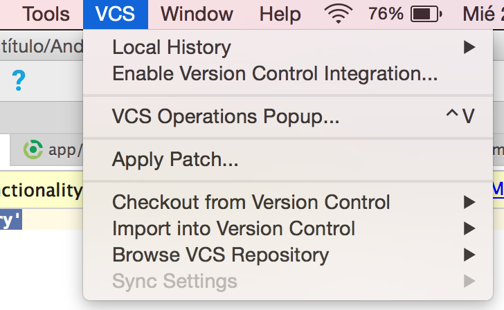
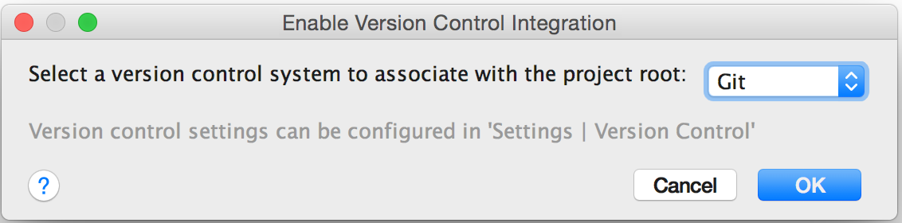
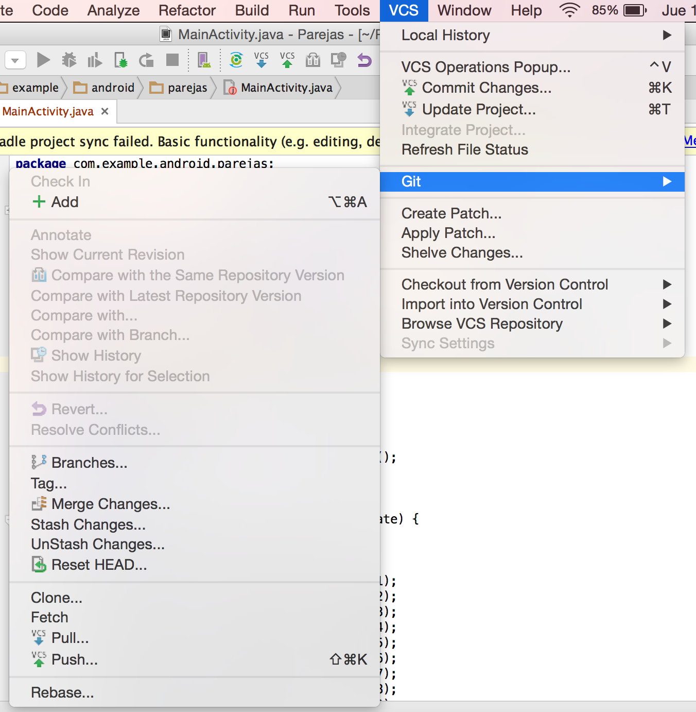
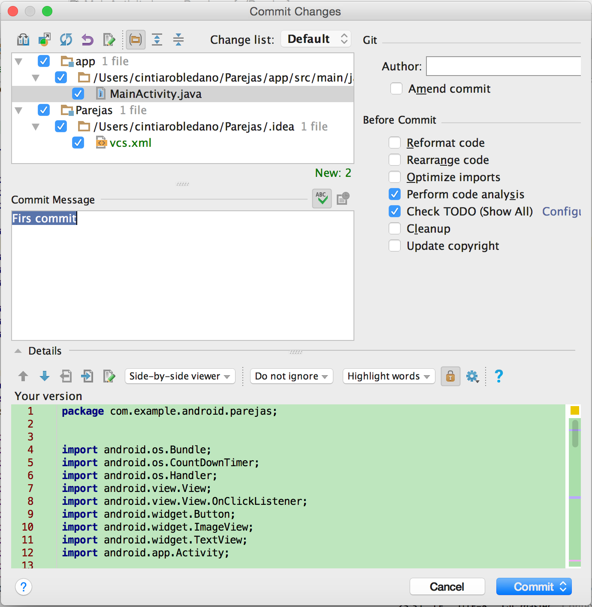
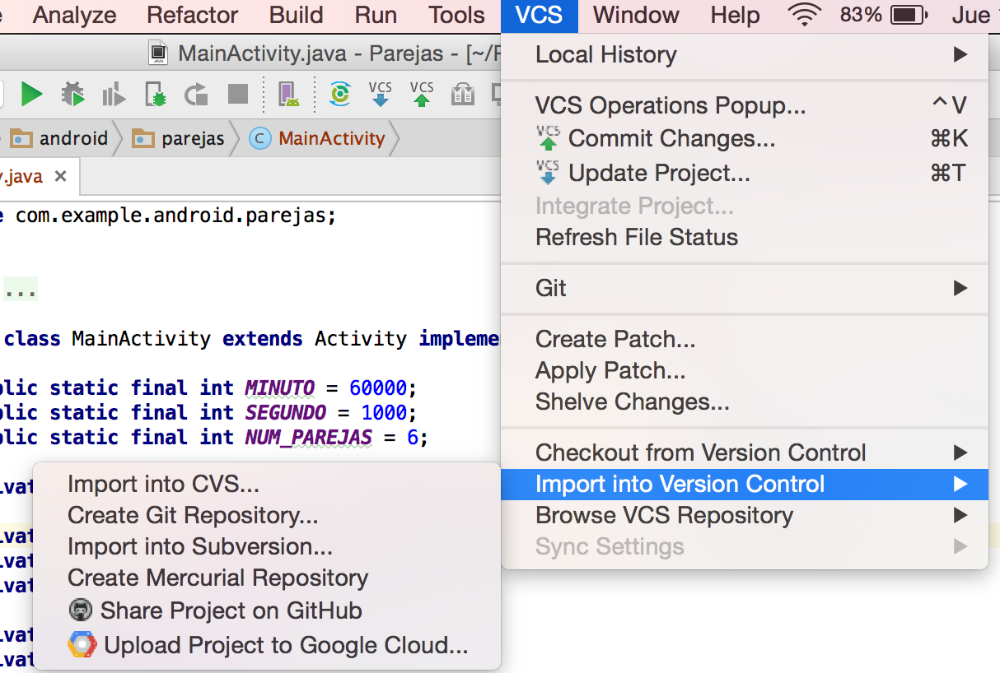
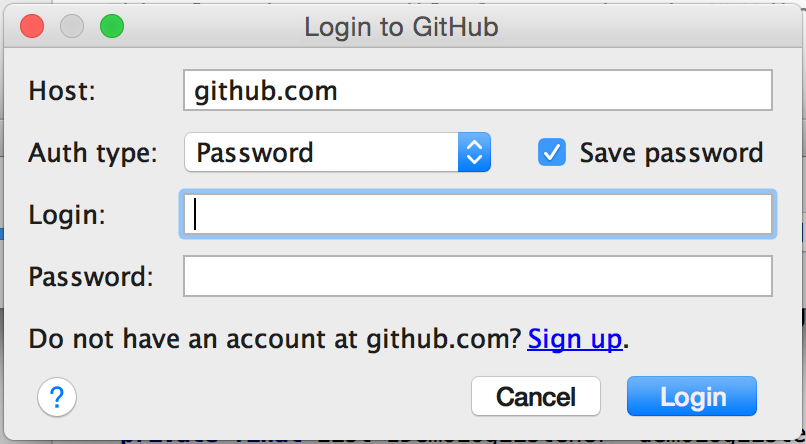
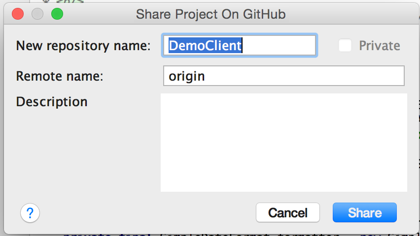
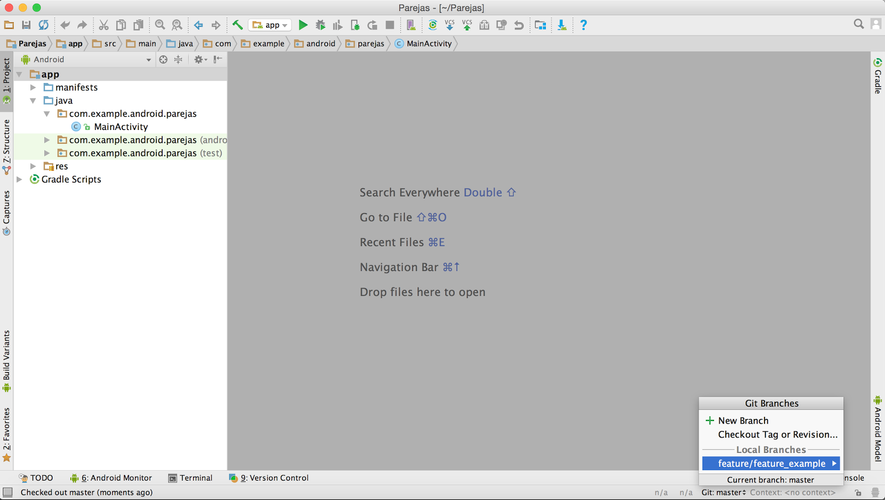

Version Control
===============

Version Your App
----------------
Versioning is a critical component of your app upgrade and maintenance strategy. Versioning is important because:

   - Users need to have specific information about the app version that is installed on their devices and the upgrade versions available for installation.
   - Other apps, including other apps that you publish as a suite, need to query the system for your app's version, to determine compatibility and identify dependencies.
   - Services through which you will publish your app(s) may also need to query your app for its version, so that they can display the version to users. A publishing service may also need to check the app version to determine compatibility and establish upgrade/downgrade relationships.  

The Android system does not use app version information to enforce restrictions on upgrades, downgrades, or compatibility of third-party apps. Instead, you are responsible for enforcing version restrictions within your app or by informing users of the version restrictions and limitations. The Android system does, however, enforce system version compatibility as expressed by the `minSdkVersion` setting in the build files. This setting allows an app to specify the minimum system API with which it is compatible.

### Set Application Version Information

To define the version information for your app, set values for the version settings in the Gradle build files. These values are then merged into your app's manifest file during the build process.  

If your app defines the app version directly in the `<manifest>` element, the version values in the Gradle build file will override the settings in the manifest. Additionally, defining these settings in the Gradle build files allows you to specify different values for different versions of your app. For greater flexibility and to avoid potential overwriting when the manifest is merged, you should remove these attributes from the `<manifest>` element and define your version settings in the Gradle build files instead.  

Two settings are available, and you should always define values for both of them:
   - *versionCode*: An integer used as an internal version number. This number is used only to determine whether one version is more recent than another, with higher numbers indicating more recent versions. This is not the version number shown to users; that number is set by the `versionName` setting, below.  
   The value is an integer so that other apps can programmatically evaluate it, for example to check an upgrade or downgrade relationship. You can set the value to any integer you want, however you should make sure that each successive release of your app uses a greater value. The system does not enforce this behavior, but increasing the value with successive releases is normative.  
   Typically, you would release the first version of your app with `versionCode` set to 1, then monotonically increase the value with each release, regardless whether the release constitutes a major or minor release. This means that the `versionCode` value does not necessarily have a strong resemblance to the app release version that is visible to the user (see versionName, below). Apps and publishing services should not display this version value to users.  
   The greatest value Google Play allows for `versionCode` is 2100000000.  

   - *versionName*: A string used as the version number shown to users. This setting can be specified as a raw string or as a reference to a string resource. The value is a string so that you can describe the app version as a <major>.<minor>.<point> string, or as any other type of absolute or relative version identifier. The versionName has no purpose other than to be displayed to users.  

The Android framework provides an API to let you query the system for version information about your app. To obtain version information, use the **getPackageInfo(String, int)** method of *PackageManager*.  
When you use Instant Run, Android Studio automatically sets the versionCode to MAXINT and the versionName to "INSTANTRUN".

### Specify API Level Requirements

If your app requires a specific minimum version of the Android platform, you can specify that version requirement as API level settings in the app's `build.gradle` file. During the build process, these settings are merged into your app's manifest file. Specifying API level requirements ensures that your app can only be installed on devices that are running a compatible version of the Android platform.  
If you specify API level requirements directly in your app's manifest file, the corresponding settings in the build files will override the settings in the manifest file. Additionally, defining these settings in the Gradle build files allows you to specify different values for different versions of your app. For greater flexibility and to avoid potential overwriting when the manifest is merged, you should remove these attributes from the `<uses-sdk>` element and define your API level settings in the Gradle build files instead.  

There are two API level settings available:  
   - *minSdkVersion*: The minimum version of the Android platform on which the app will run, specified by the platform's API level identifier.  

   - *targetSdkVersion*: Specifies the API level on which the app is designed to run. In some cases, this allows the app to use manifest elements or behaviors defined in the target API level, rather than being restricted to using only those defined for the minimum API level.  

When preparing to install your app, the system checks the value of these settings and compares them to the system version. If the `minSdkVersion` value is greater than the system version, the system prevents the installation of the app.  
If you do not specify these settings, the system assumes that your app is compatible with all platform versions.  

Versioning your code
--------------------

Android Studio supports a variety of version control systems (VCS’s), including Git, GitHub, CVS, Mercural, Subversion, and Google Cloud Source Repositories.  
After importing your app into Android Studio, use the Android Studio VCS menu options to enable VCS support for the desired version control system, create a repository, import the new files into version control, and perform other version control operations:

  1. From the Android Studio **VCS** menu, click **Enable Version Control Integration**.  
  2. From the drop-down menu, select a version control system to associate with the project root, and then click **OK**.  

The VCS menu now displays a number of version control options based on the system you selected.  

#### Using Git as your version control system

***1. Test if Git is Configured***  
In Android Studio, go to **File > Settings** (on Mac, **Android Studio > Preferences**) **> Version Control > Git**. Then click ‘Test’ to ensure that Git is configured properly in Android Studio.  

***2. Enable Version Control Integration***  
Prior to using Git or any other version control with an existing project, ‘version control integration’ should be enabled. In Android Studio, got to **VCS > Enable Version Control Integration**. This step is for an already existing project in Android Studio, that is not is integrated with any version control.  

On enable, we will get a dialog window with options to choose like CVS, Git, Mercurial and Subversion. We will choose Git as example.  

On successful enable the options under VCS menu will change showing the Git options to add, commit, etc. The color of the files in Android Studio project explorer will change to brown from previous black. This indicates that the files are new and yet to be added to Git server.  

***3. gitignore – Exclude Files from Git***  
This is an important step before adding the project files to Git version control. We do not want all the files from Android Studio to be added to Git. Files like generated code, binary files (executables) should not be added to Git (version control). Git provides a feature using which we can inform Git that the list of files given should be excluded in version control.  
Create a TXT file and name of the file should be `.gitignore`. There is no name for this file and ‘gitignore’ is the extension. It’s just a text file with list of file names to be excluded. You can put this file in the project root folder in Android Studio. This is an example of .gitignore file for Android projects. It’s almost the same for all Android projects.

	# Mac filetypes  
	.DS_Store  

	# built application files  
	*.apk  

	# files for the dex VM  
	*.dex  

	# Java class files  
	*.class  

	# generated files  
	bin/  
	gen/  

	# Local configuration file (sdk path, etc)  
	local.properties  

	# Intellij project files  
	*.iml  
	*.ipr  
	*.iws  
	.idea/  
	out/  

	# anothers  
	.orig  

	#gradle  
	.gradle/  
	build/  
	app/build/  

***4 Using Git***  
***4.1 Git with Local***  
Now the project is ready to use with Git version control. Now it depends on your choice of the Git server. If you choose to use Git in just your local system (which is highly unlikely), you are all set. Go to **VCS > Git > Add** and the files are now added to Git and then you need to commit the changes. Now go to **VCS > Commit Changes** and you will get a dialog to enter the comments and to commit. Done and the project is added to Git.  

If you wish to add the project to a remote repository that is residing somewhere on the network you need to add the project to remote repository and then use it.  

***4.2 Git using GitHub with Android Studio***  
GitHub is an online service for project hosting using Git version control. To host the project on Git, a Git account should be created in github.com. Now you can share the Android project on GitHub. Go to **VCS > Import into Version Control > Share Project on GitHub**.  

Login with GitHub credentials:

Create a new repository on GitHub and push the project to the GitHub repository.  

***4.3 Git using Bitbucket or Any Repo with Android Studio***  
Bitbucket does not have a direct import feature as GitHub has. For remote Git repositories like Bitbucket which does not have an explicit import feature in Android Studio, we can use the command line and add the project to the remote repository. This is also applicable if you are in a company network and you have your own remote Git server.  

Go to terminal, change to project root in Android Studio and execute the following command:  

	> git remote add origin https://user@bitbucket.org/user/wordpower.git

The URL is the Git remote repository.

#### Git Flow
Generally teams have two branches: master and develop. Everyone commits straight to develop. If a person is in mid-feature or testing something out, often they would not commit their work until they were done, keeping their code only on their local machines. This can be very problematic and losing code is easy to do. Releases were made by merging develop straight into master branch and tagging the commit with the release number.

This method of using git works ok for small sized teams of 2 – 3 developers. As soon as there are more developers on the team, things quickly become difficult to manage. Problems with this approach include: Branches stemming from different sources, branches created from other branches and not knowing what to do if there is a bug on production but there are new commits on the develop branch.

Git Flow cames to solve these problems. The following diagram describes Git Flow really well:  

Git Flow basically has the following different types of branches:

   - **Master**: contains the last released version of your application, code that is in a production ready state. It also contains all the tags for each release that was made.

   - **Develop**: contains work that has recently been integrated from features. This contains work that will be delivered into the next release. This is where daily builds come from.

   - **Feature**: these branches are created every time a new story or bug is worked on. Feature branches are named after the relevant story number or equivalent feature name feature/feature_<story_number>. Feature branches are ONLY created from develop. Features get merged into develop once it solves a bug or complete a story. Using pull requests to ensure that the code has been peer reviewed before merging it into develop is also a great way to manage bigger teams.

   - **Release**: once a release is ready to be made, a branch named *release/release_< version_number >* is created from develop. This branch can then be used to make small changes. Quality Assurance and User testing then happens with the builds from this branch. Once QA has passed, the release branch gets merged into develop and into master, this is also when the commit gets tagged with the version number.

   - **Hotfix**: if there is an issue on production and we are in the process of adding extra features onto develop, we can easily create a hotfix branch (*hotfix/hotfix_< hotfix_number >*) from master. Complete the fix, merge the fix into master and create another tag for the version name.

This Branching Model is particularly useful for Android development for the following reasons:

   - When needing to test user upgrade processes (database upgrades etc), checking out old versions of the code and building them is really straightforward.  
   - It is very simple to debug issues happening on production that might not be happening on development, checking out the version of code that has the crashes and debugging from there is really simple.  
   - Pull requests help improve the quality of the code, things are picked up before they are merged into development. Bugs are also found quicker.  
   - Easy to understand method even for beginners.  
   - Everyone understands how to use the branches and where branches can be made from and incorporated into. There is no guess work with regards to where a branch came from and how to merge it in.  
   - Because we do not release every single bug fix or feature into production, we decided using git flow is the best choice.

Not all Git clients provide support for Git flow. A list of a couple that do support Git Flow:

   - [Git Flow for command line](https://github.com/nvie/gitflow/wiki/Installation)  
   - [Android Studio Plugin for Git Flow](https://github.com/OpherV/gitflow4idea/)  
   - [Smart Git](http://www.syntevo.com/smartgit/)  
   - [Source Tree](https://www.sourcetreeapp.com/)  
   - [Tower](https://www.git-tower.com/mac/)  

**NOTE:** For more information about Git Flow [DevOps Repository](https://github.com/beeva/beeva-best-practices/tree/master/devops/git#git-flow)

#### Changing working branch from Android Studio
Developers can change the branch they are working on  by selecting the branch they want in the bottom left corner of Android Studio. This improves the management of Git Flow from Android Studio.  

